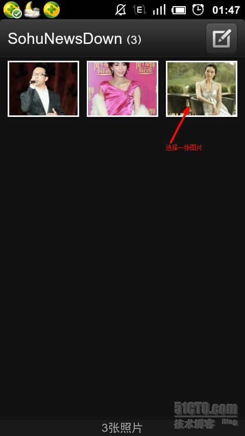
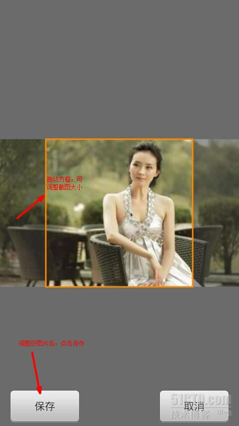
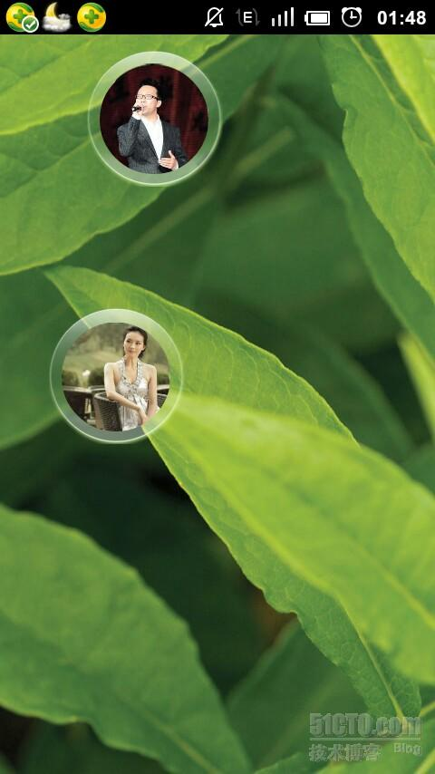

# Lock screen on the touch_lock screen application

#### Introduction
Drag the two balls to collide together to unlock the screen. You can choose your own picture from the album,

Features:

  1. Lock screen\Unlock: Drag the crystal ball to collide to unlock it.

  2. The avatar on the crystal ball can be replaced at will, and the visual operation is very simple.

  3. Free setting of sound and vibration effects.

Applications written in 2013;

#### Tutorial

  

 

 

   

#### Participation Information

http://www.eoeandroid.com/forum.php?mod=viewthread&tid=175929

http://ericchan2012.iteye.com/blog/1699361

http://www.eoeandroid.com/forum.php?mod=viewthread&tid=177610

###### Colorful Bubble Game

1. Colorful bubble lock screen
2. Colorful bubble game: similar to the ring game machine in reality

There is a needle on the interface, press left and right to blow, the bubbles float, and the score is scored

http://s.1688.com/selloffer/offer_search.htm?keywords=%CC%D7%C8%A6%C8%A6%D3%CE%CF%B7%BB%FA&button_click=top&earseDirect=false&n=y

http://www.eoeandroid.com/forum.php?mod=viewthread&tid=238022&extra=page%3D1&page=1
[Application code] Android third-party lock screen software source code

http://www.eoeandroid.com/thread-233948-1-1.html
[Android example] I'm currently working on the framework of QQ for Pad

http://www.eoeandroid.com/thread-245388-1-1.html
How to hack APK

http://www.eoeandroid.com/thread-160824-1-1.html
[Android example] Qiyi HD UI interface source code

http://www.eoeandroid.com/thread-245154-1-1.html
[Android example] android special effects example code (Shen Jing) years collection

luck ball
Lucky Bubble Lock Screen
Lucky Bumper Ball Lock Screen
Lucky Bounce Ball Lock Screen
http://www.eoeandroid.com/forum.php?mod=viewthread&tid=116148
[Android example] Fine imitation of QQ setting interface (custom PreferenceActivity) with pictures and truth
[Very strong]
http://www.eoeandroid.com
Android example tutorial (421)

http://www.eoeandroid.com/forum-27-1.html
Qingfengxiao

http://www.eoeandroid.com/thread-196576-1-1.html
[Android example] Highly imitate QQ setting sliding button, beautiful and simple
http://blog.csdn.net/geniuseoe2012
http://blog.csdn.net/geniuseoe2012/article/details/7742344

http://download.csdn.net/download/geniuseoe2012/4425939

http://blog.csdn.net/feiba9/article/details/7438011
Android setting interface development.
(PreferenceActivity)

================================================= ====
Baidu:
Whether the two balls collide
Whether the two balls collide
http://blog.csdn.net/bird_wang/article/details/2124139
Use java to simulate the random movement and collision of two balls.

http://download.csdn.net/tag/ Two ball collision

android lock screen code

http://www.douban.com/group/topic/26552730/
How to make a round button in android?

fillOval determines that the mouse is inside the circle
http://www.baidu.com/s?tn=baiduhome_pg&ie=utf-8&bs=fillOval&f=8&rsv_bp=1&rsv_spt=1&wd=fillOval+%E5%88%A4%E6%96%AD%E9%BC%A0%E6% A0%87%E5%9C%A8%E5%9C%86%E5%86%85&rsv_sug3=6&rsv_sug1=6&rsv_sug4=626&inputT=11336

http://zhidao.baidu.com/question/489238539.html
http://www.pudn.com/downloads116/sourcecode/java/detail493911.html

Keywords: bubble screensaver code
http://download.csdn.net/detail/zangchang/2233158
Colorful bubble screensaver source code

http://download.csdn.net/detail/meimei881013/3673138
Android+ screensaver source code
http://download.csdn.net/detail/ab81501320/3403392
android screensaver development

http://www.pudn.com/downloads390/sourcecode/java/detail1669833.html
A complete Android screensaver source code, suitable for beginners-

http://blog.csdn.net/happyq/article/details/7231576
Development of screensaver programs under Android. (Same: Android+ screensaver source code)

http://www.eoeandroid.com/code/2012/0618/1671.html
Realization source code of android screensaver written by myself

------------------------------

http://topic.csdn.net/u/20100713/16/de496b06-273c-40b2-a63e-6e3e8afe78e9.html
java

http://www.cnblogs.com/easyfrog/archive/2012/02/06/2340664.html
C# Simulate WIN7 bubble screen saver (pinball simulation)

 

http://www.pudn.com/downloads111/sourcecode/game/detail462334.html
A pinball written by j2me. When I first learned j2me, my teacher, Mr. Chen, gave me a very good game, very suitable for beginners to learn!

 

: Collision and rebound formula
http://space.flash8.net/space/?246908/viewspace-387310
Vector in flash (7) Two balls collide

http://topic.csdn.net/u/20100830/10/dd5d904c-df38-4b76-a4f9-126de032c1c9.html
Ask about the algorithm of collision and rebound of two small balls

 

http://bbs.9ria.com/thread-2115-1-1.html
How to calculate the collision rebound? Demo

http://download.csdn.net/detail/gouyue/1274255
The screensaver program of the bouncing ball.scr (written by VB source code)-download channel-CSDN.NET

http://topic.csdn.net/u/20100713/16/de496b06-273c-40b2-a63e-6e3e8afe78e9.html

 