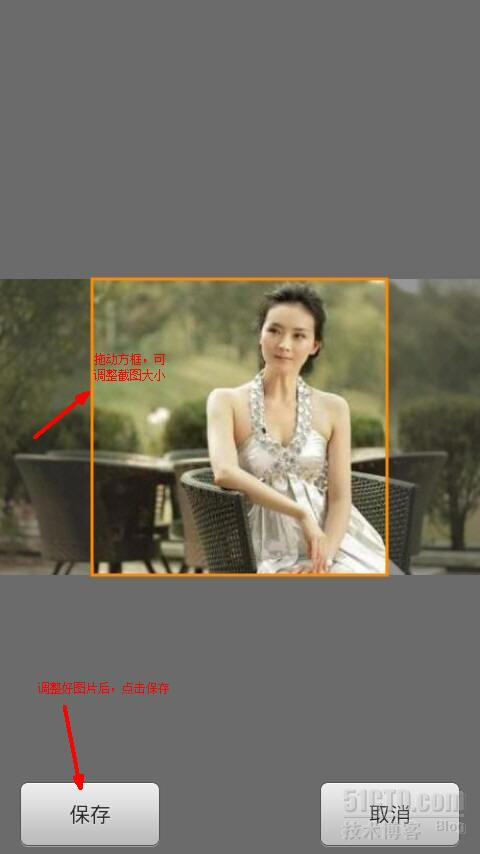
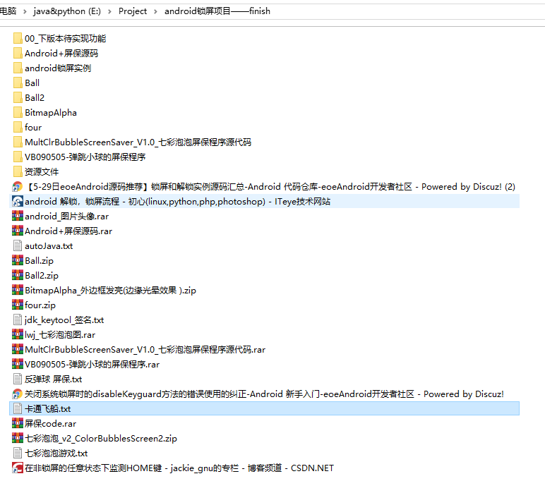

# 锁屏对对碰_锁屏应用

#### 介绍
拖动两小球碰撞在一起即可解锁屏幕。你可以从相册中选择你自己的图片， 

功能：

  1. 锁屏\解锁：拖动水晶球相撞即可解锁。

  2. 水晶球上的头像可以随意替换，可视化操作非常简易。

  3. 声音、振动效果自由设置。  

2013写的应用；

#### 使用教程

  

  

 

    

#### 参与资料

http://www.eoeandroid.com/forum.php?mod=viewthread&tid=175929

http://ericchan2012.iteye.com/blog/1699361

http://www.eoeandroid.com/forum.php?mod=viewthread&tid=177610

###### 七彩泡泡游戏

1. 七彩泡泡锁屏
2. 七彩泡泡游戏：类似现实中的套圈圈游戏机

	界面有针，按左右吹气，气泡飘起，扎中得分

http://s.1688.com/selloffer/offer_search.htm?keywords=%CC%D7%C8%A6%C8%A6%D3%CE%CF%B7%BB%FA&button_click=top&earseDirect=false&n=y

http://www.eoeandroid.com/forum.php?mod=viewthread&tid=238022&extra=page%3D1&page=1
[应用代码] Android第三方锁屏软件源码

http://www.eoeandroid.com/thread-233948-1-1.html
[Android实例] 最近在做QQ for Pad的框架

http://www.eoeandroid.com/thread-245388-1-1.html
如何破解APK

http://www.eoeandroid.com/thread-160824-1-1.html
[Android实例] 奇艺高清UI界面源代码

http://www.eoeandroid.com/thread-245154-1-1.html
[Android实例] android特效实例代码（申精）多年珍藏 

luck ball
幸运泡泡锁屏
幸运碰碰球锁屏
幸运反弹球锁屏
http://www.eoeandroid.com/forum.php?mod=viewthread&tid=116148
[Android实例] 精仿QQ设置界面（自定义PreferenceActivity）有图有真相 
【非常强】
http://www.eoeandroid.com
Android 实例教程 (421)

http://www.eoeandroid.com/forum-27-1.html
清风笑

http://www.eoeandroid.com/thread-196576-1-1.html
[Android实例] 高仿QQ设置滑动按钮，漂亮简单 
http://blog.csdn.net/geniuseoe2012
http://blog.csdn.net/geniuseoe2012/article/details/7742344

http://download.csdn.net/download/geniuseoe2012/4425939

http://blog.csdn.net/feiba9/article/details/7438011
Android设置界面开发 .
(PreferenceActivity)

======================================================
百度：
两小球是否碰撞
两球是否碰撞
http://blog.csdn.net/bird_wang/article/details/2124139
用java模拟两球的随机运动及碰撞 .

http://download.csdn.net/tag/两球碰撞

android 锁屏code

http://www.douban.com/group/topic/26552730/
android中，如何做圆形的button按钮？ 

fillOval 判断鼠标在圆内
http://www.baidu.com/s?tn=baiduhome_pg&ie=utf-8&bs=fillOval&f=8&rsv_bp=1&rsv_spt=1&wd=fillOval+%E5%88%A4%E6%96%AD%E9%BC%A0%E6%A0%87%E5%9C%A8%E5%9C%86%E5%86%85&rsv_sug3=6&rsv_sug1=6&rsv_sug4=626&inputT=11336

http://zhidao.baidu.com/question/489238539.html
http://www.pudn.com/downloads116/sourcecode/java/detail493911.html

关键词：气泡屏保 代码
http://download.csdn.net/detail/zangchang/2233158
七彩泡泡屏保程序源代码

http://download.csdn.net/detail/meimei881013/3673138
Android+屏保源码
http://download.csdn.net/detail/ab81501320/3403392
android屏保开发

http://www.pudn.com/downloads390/sourcecode/java/detail1669833.html
一个完整的Android屏保源码，初学者适用-

http://blog.csdn.net/happyq/article/details/7231576
Android下屏保程序的开发 .(一样:Android+屏保源码)

http://www.eoeandroid.com/code/2012/0618/1671.html
自己编写的android屏保的实现源码

------------------------------

http://topic.csdn.net/u/20100713/16/de496b06-273c-40b2-a63e-6e3e8afe78e9.html
java

http://www.cnblogs.com/easyfrog/archive/2012/02/06/2340664.html
C# 模拟WIN7水泡屏保(弹球模拟)

 

http://www.pudn.com/downloads111/sourcecode/game/detail462334.html
j2me写的一个弹球,当初学j2me的时候教我的老师陈老师给我的挺不错一个游戏,很适合初学者学习!

 

:碰撞 反弹公式
http://space.flash8.net/space/?246908/viewspace-387310
flash中的向量（7）两球碰撞

http://topic.csdn.net/u/20100830/10/dd5d904c-df38-4b76-a4f9-126de032c1c9.html
请教两个小球碰撞反弹的算法

 

http://bbs.9ria.com/thread-2115-1-1.html
碰撞反弹，如何计算？ 有demo

http://download.csdn.net/detail/gouyue/1274255
弹跳小球的屏保程序.scr(VB源代码编写) - 下载频道  - CSDN.NET

http://topic.csdn.net/u/20100713/16/de496b06-273c-40b2-a63e-6e3e8afe78e9.html

 